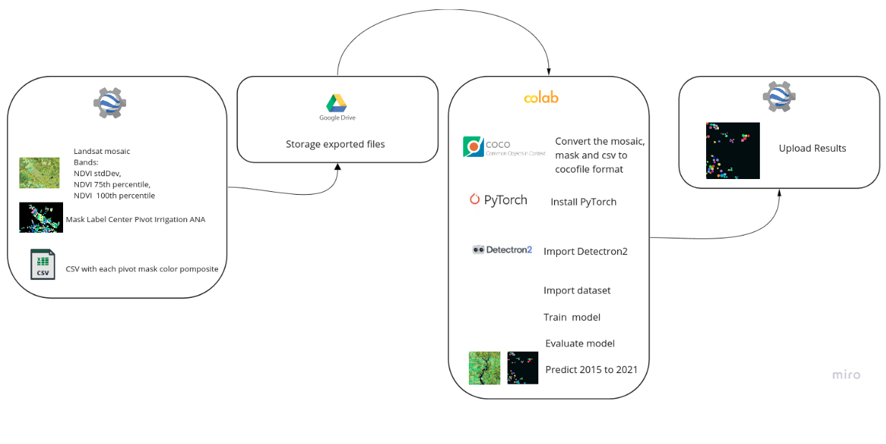

    
    <h1>Center Pivot Irrigation Dynamics</h1>

Developed by ***Agrosatélite Geotecnologia Aplicada***.

## About

This folder contains the scripts necessary to obtain the **Center Pivot Irrigation Dynamics** product. This product is a ***beta*** version and these scripts should be used with caution. 

We recommend that you read the [Irrigation Appendix of the Algorithm Theoretical Basis Document (ATBD)](https://mapbiomas.org/download-dos-atbds), since important informations about the methodology can be found in there.

 

---

## How to use

### Instance Segmentation

#### Using the already trained MapBiomas Neural Network:

1. Run the *[Google Earth Engine script](https://code.earthengine.google.com/?scriptPath=users%2Fagrosatelite_mapbiomas%2Fmapbiomas_tutorial%3Acollection7%2Firrigation%2Fpivot_dynamics%2F04_save_predict_mosaics.js)* to save Landsat mosaic to pretict 

2. Run the [Colab Notebook](https://github.com/mapbiomas-brazil/irrigation/blob/mapbiomas70/pivot-dynamics/Instance_segmentation_pivot/Predict/2_Run_predict_trained_model.ipynb)

#### To train your own Neural Network
To train your own model, you have to follow the steps presented in figure bellow:

1. To train your own model, first you have to save the train and test datasets. Follow the steps below:
    1. Run the [GEE script](https://code.earthengine.google.com/?scriptPath=users%2Fagrosatelite_mapbiomas%2Fmapbiomas_tutorial%3Acollection7%2Firrigation%2Fpivot_dynamics%2F01_export_training_samples.js) and save tree files per tile: mosaic.tif, labels.tif and mosaic.csv files. Save these files in a Google Drive folder;
    2. Run the [Notebook Colab](https://code.earthengine.google.com/?scriptPath=users%2Fagrosatelite_mapbiomas%2Fmapbiomas_tutorial%3Acollection7%2Firrigation%2Fpivot_dynamics%2F01_export_training_samples.js)  to convert the exported GEE files to Cocofile format.

2. The next step is to train de instance segmentation model, using Pythorch and Detectron2 library, running [This Colab Notebook](https://github.com/mapbiomas-brazil/irrigation/blob/mapbiomas70/pivot-dynamics/Instance_segmentation_pivot/Train_model/3_Train_model.ipynb)

 

### Instance Segmentation Post-processing

To run the post-processing, follow these steps:

1. **Erosion Filter**:

    1. Open the script **irrigation/pivot_dynamics/02A_erosion_filter.js**;

    2. On **line 48** (variable `years`) set a list of years you want to process;

    3. On **line 52** (variable `output`) set the output path for an imageCollection. On **line 54** (variable `filename`) set the individual filename prefix for your output; 

    4. On **line 57** (variable `tilesCollections`) set the path for the imageCollection containing the results you uploaded from the Neural Network;

    5. Run the script.

2. **Spatial and Dilation Filter**:

    1. Open the script **irrigation/pivot_dynamics/02B_spatial_and_dilation_filter.js**;

    2. On **line 44** (variable `years`) set a list of years you want to process;

    3. On **line 47** (variable `output`) set the output path for an imageCollection. On **line 50** (variable `filename`) set the individual filename prefix for your output; 

    4. On **line 70** (variable `raw_erosion`) set the path to the erosion filter results;

    5. Run the script.

3. **Tamporal and Spatial Filter**:

    1. Open the script **irrigation/pivot_dynamics/02C_temporal_spatial_filter.js**;

    2. On **line 48** (variable `col`) set the path to the spatial and dilation filter results;

    3. On **line 51** (variable `years`) set a list of years you want to process;

    4. On **line 54** (variable `output`) set the output folder for the results. On **line 57** (variable `filename`) set the individual filename prefix for your output; 

    5. Run the script.

 

### Individual Pivot Information

1. **Pivot Information**

    1. Open the script **irrigation/pivot_dynamics/03A_pivot_information.js**;

    2. On **line 77** (variable `years`) set a list of years you want to process;

    3. On **line 81** (variable `op`) set a list of Landsat scenes (Path/Row) you want to process;

    4. On **line 136** (variable `outputCollection`) set the output path for the results. On **line 139** (variable `filename`) set the individual filename prefix for your output; 

    5. On **line 237** (variable `pivot`) set the path for the post-processing results;

    6. Run the script. 

2. **Rasterize Pivots (OPTIONAL)**

    1. Open the script **irrigation/pivot_dynamics/03B_rasterize_pivots.js**;

    2. On **line 27** (variable `years`) set a list of years you want to process;

    4. On **line 31** (variable `output_destination`) set an imageCollection path for the results. On **line 32** (variable `output_name`) set the individual filename prefix for your output; 

    5. On **line 38** (variable `pivot`) set the path for the pivot information results;

    6. On **line 55** (variable `img_pivot`) you can change the band names for the output;

    6. Run the script. 
